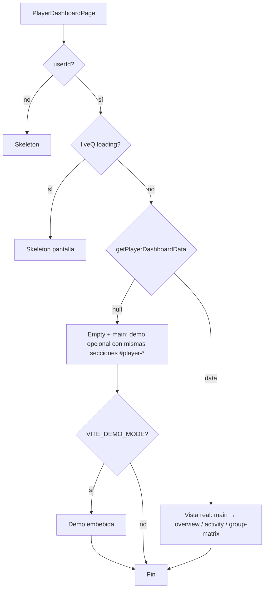

# Estructura de la pantalla del jugador (`/player`)

Página principal del espacio del jugador: **`PlayerDashboardPage`** (`src/pages/player/PlayerDashboardPage.tsx`).  
Ruta en la app: **`/player`** (protegida con `RequireAuth` en `src/app/router.tsx`).

Los textos visibles de muchas tarjetas vienen de **`PLY_COPY`** en `src/lib/playerDashboardCopy.ts`.

---

## Flujo de datos

| Origen | Descripción |
|--------|-------------|
| `useAuthStore` | `user.id`, `profile` (nombre, rol). |
| `useQuery` + `getPlayerDashboardData` | `src/services/dashboardPlayer.ts`: primer **torneo `active`** donde el usuario tiene fila en `group_players`, con jugadores, partidos, reglas y ranking calculado. |

Si no hay torneo/grupo activo para el usuario, `liveQ.data` es `null` y se muestra el **estado vacío** (y opcionalmente demo).

---

## Estados de la pantalla

### 1. Sin sesión (`!userId`)

- Bloques **Skeleton** (carga genérica), con `px-4 md:px-6` alineado al resto de la vista.

### 2. Cargando datos (`liveQ.isLoading`)

- **Skeleton** en contenedor `max-w-7xl` con `px-4 md:px-6`.

### 3. Con torneo real (`liveQ.data` presente)

Vista conectada a datos reales: torneo, grupo, reglas y partidos reales. El contenido va en **`<main class="mx-auto max-w-7xl space-y-8 …">`** (`px-4 md:px-6`, `py-6 md:py-8`, `md:space-y-10`).

Tres secciones semánticas con `id` y `aria-labelledby`:

| `id` | Contenido | Título accesible |
|------|-----------|------------------|
| `#player-overview` | `PlayerWelcomeHero` → `PlayerMarcadorHub` → `PlayerQuickStats` → `PlayerProgressCard` | `h2#heading-player-overview` (solo lector de pantalla: `PLY_COPY.overviewSectionSrLabel`) |
| `#player-activity` | `DashboardSectionHeader` + grid 8/4: listas de partidos/resultados + aside (grupo, posición, insight) | `h2#heading-activity-lists` |
| `#player-group-matrix` | `DashboardSectionHeader` + grid 8/4: `ResultsMatrixCard` + `GroupRankingCard` | `h2#heading-group-matrix` |

`DashboardSectionHeader` (`src/components/player-dashboard/DashboardSectionHeader.tsx`) unifica título, subtítulo, *eyebrow* y acción (p. ej. enlace a la matriz) para **actividad** y **matriz**.

En viewport **ancho (xl+)**, el grid principal de actividad y matriz usa **`xl:grid-cols-12`** con columnas **8 + 4**; por debajo de `xl` el layout apila en columna. Los aside con tarjetas secundarias conservan **`lg:sticky`** donde ya existía; no se fuerza sticky en móvil.

Sublínea del hero con datos reales: **`PLY_COPY.welcomeSubLive`** (sin tecnicismos).

`PlayerProgressCard` muestra, bajo el título de progreso, la línea **`PLY_COPY.progressCompleteMessage(played, total)`** (mismo criterio de totales que la barra).

### 4. Sin grupo activo (`data === null`)

- Tarjeta con mensaje **“Aún no estás en un torneo activo”** y enlaces a `/tournaments` y `/simulation`, dentro de un **`<main>`** con el mismo ancho y padding que la vista con datos, para un ritmo visual coherente.
- Si `VITE_DEMO_MODE === 'true'`, debajo se embebe la **demo** (mismo `main`, mismas secciones `#player-*` aproximadas: overview → actividad → matriz, con `DashboardSectionHeader` y grid `xl:12`).

---

## Árbol visual — vista con datos reales (caso principal)

Contenedor raíz: `tdash-root` → **`<main>`** ancho máximo **`max-w-7xl`**, espaciado vertical `space-y-8 md:space-y-10` entre secciones.

```
PlayerDashboardPage (datos reales)
└── <main>
    ├── <section id="player-overview" aria-labelledby="heading-player-overview">
    │   ├── h2#heading-player-overview (sr-only)
    │   ├── PlayerWelcomeHero (welcomeSubLive)
    │   ├── PlayerMarcadorHub
    │   │   ├── Cabecera — PLY_COPY.marcadorHub*
    │   │   ├── CTA: enlace a matriz (/tournaments/:id?group=:gid)
    │   │   ├── Ancla → #panel-partidos-marcador
    │   │   ├── Ancla → #panel-resultados-marcador
    │   │   └── [opcional] aviso allow_player_score_entry
    │   ├── PlayerQuickStats
    │   └── PlayerProgressCard
    ├── <section id="player-activity" aria-labelledby="heading-activity-lists">
    │   ├── DashboardSectionHeader (PLY_COPY.activitySection*)
    │   └── Grid xl:12
    │       ├── Col 8
    │       │   ├── #panel-partidos-marcador.scroll-mt-24 → UpcomingMatchesCard
    │       │   └── #panel-resultados-marcador.scroll-mt-24 → SimMyResultsCard
    │       └── Col 4 (sidebar sticky) → PlayerGroupCard, MyStandingCard, PerformanceInsightCard
    └── <section id="player-group-matrix" aria-labelledby="heading-group-matrix">
        ├── DashboardSectionHeader (matriz; título con nombre de grupo, PLY_COPY.matrixSectionSub)
        └── Grid xl:12
            ├── Col 8 → ResultsMatrixCard
            └── Col 4 (sticky) → GroupRankingCard
```

Opcional al final del `<main>`: enlace a **`/simulation`** si `VITE_DEMO_MODE` es `true`.

---

## Anclas HTML (acceso rápido)

| ID | Uso |
|----|-----|
| `#player-overview` / `#player-activity` / `#player-group-matrix` | Secciones de la página; enlaces o deep-link. |
| `#panel-partidos-marcador` | Lista **Tus partidos (marcador)** (`UpcomingMatchesCard`). |
| `#panel-resultados-marcador` | **Tus resultados** (`SimMyResultsCard`). |

`#panel-partidos-marcador` y `#panel-resultados-marcador` conservan **`scroll-mt-24`** para que el scroll desde el hub no quede oculto bajo el header de la app.

---

## Componentes hijos (referencia rápida)

| Componente | Archivo | Rol en la vista real |
|------------|---------|------------------------|
| `DashboardSectionHeader` | `src/components/player-dashboard/DashboardSectionHeader.tsx` | Encabezado homogéneo de secciones (actividad, matriz). |
| `PlayerWelcomeHero` | `src/components/player-dashboard/PlayerWelcomeHero.tsx` | Cabecera de bienvenida / contexto torneo. |
| `PlayerMarcadorHub` | `src/components/player-dashboard/PlayerMarcadorHub.tsx` | Accesos al marcador y anclas a listas. |
| `PlayerQuickStats` | `src/components/player-dashboard/PlayerQuickStats.tsx` | Resumen numérico rápido. |
| `PlayerProgressCard` | `src/components/player-dashboard/PlayerProgressCard.tsx` | Progreso partidos jugados / esperados (RR). |
| `UpcomingMatchesCard` | `src/components/player-dashboard/UpcomingMatchesCard.tsx` | Cruces donde aún aplica captura/corrección. |
| `SimMyResultsCard` | `src/components/player-dashboard/SimMyResultsCard.tsx` | Listado de resultados del jugador (usa tipos `SimMatch` vía `matchRowsToSimMatches`). |
| `PlayerGroupCard` | `src/components/player-dashboard/PlayerGroupCard.tsx` | Rivales del grupo. |
| `MyStandingCard` | `src/components/player-dashboard/MyStandingCard.tsx` | Posición vs líder. |
| `PerformanceInsightCard` | `src/components/player-dashboard/PerformanceInsightCard.tsx` | Frases de contexto (puntos, reglas). |
| `ResultsMatrixCard` | `src/components/tournament-dashboard/ResultsMatrixCard.tsx` | Matriz del grupo (misma pieza que dashboard torneo). |
| `GroupRankingCard` | `src/components/tournament-dashboard/GroupRankingCard.tsx` | Tabla de clasificación del grupo. |

Adaptadores de datos: `groupPlayersToSimPlayers`, `matchRowsToSimMatches`, `rankingRowsToGroupStandings` en **`src/lib/realTournamentView.ts`**.

---

## Vista vacía + demo (`VITE_DEMO_MODE`)

1. Tarjeta “no estás en torneo activo”.
2. Si demo, dentro del mismo `main` y con padding compartido:
   1. **Overview** (hero, `PlayerQuickStats`, `PlayerProgressCard`).
   2. **Actividad (demo)**: listas de ejemplo + sidebar, grid `xl:12` (mismo orden móvil que en vivo: listas, luego aside).
   3. **Matriz + ranking (demo)**: `ResultsMatrixCard` + `GroupRankingCard`.

Datos: **`src/mock/miTorneoDemoBundle.ts`**. Los *heading id* de demo usan sufijo `-demo` para no colisionar con la vista con datos reales (solo una rama se renderiza).

---

## Diagrama (flujo condicional)



---

## Notas de producto

- **Un solo torneo activo** por defecto: `getPlayerDashboardData` devuelve el **primero** que cumpla criterio en la consulta; si el usuario está en varios grupos/torneos activos, solo se muestra uno hasta que se refine la lógica.
- El **marcador** en torneo real se edita en **`/tournaments/:id`** pestaña **Vista** → matriz; el hub y las tarjetas enlazan ahí.
