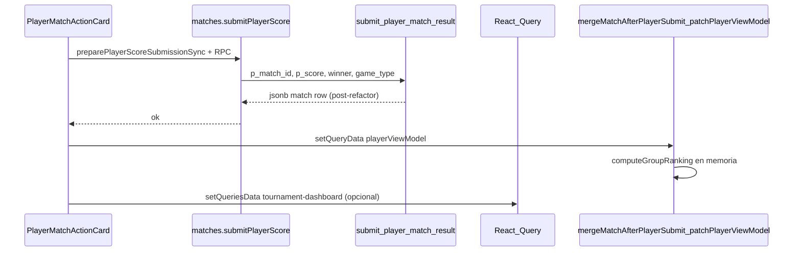

# Flujo de resultado jugador — auditoría de cache y RPC

## Diagrama (envío de marcador por jugador)

## Query keys relevantes

| Evento | Keys típicas | Estrategia |
|--------|----------------|------------|
| Submit / reenvío tras disputa | `['playerViewModel', userId, groupId]` | `setQueryData` + recomputo ranking local |
| Mismo torneo (dashboard público) | `['tournament-dashboard', tournamentId, …filters]` | `setQueriesData` con prefijo torneo, merge match + recomputo leaderboard |
| Movimiento jugador | `['playerTournamentMovement', userId, tournamentId]` | Tras mutación: `invalidateQueries` puntual (view model ya va parcheado) |
| Admin | `admin-results`, `admin-matches`, … | Sin cambiar en este flujo crítico jugador |

## RPC crítico

- **`submit_player_match_result`**: una transacción — validación, `UPDATE matches` → `closed`, log en `match_score_logs`.
- **`opponent_respond_match_score`**: solo refutación efectiva (`p_accept` rechazado); transición `closed` → `score_disputed`.

## Notas

- Standings en vivo **no** están materializados en SQL; se calculan con `computeGroupRanking` en cliente a partir de `matches` + reglas.
- No hay suscripciones Realtime en la app; la frescura entre pestañas depende de invalidación/fetch puntual.

## Medición DEV (submit / recálculo / UI)

1. Abre la consola del navegador en **DEV**.
2. Ejecuta `localStorage.setItem('perfPlayerSubmit','1')` y recarga.
3. Al enviar marcador verás prefijos `[perf]` para duración del RPC, parche de `playerViewModel` y callback posterior (`PlayerDashboardPage`).

Para desactivar: `localStorage.removeItem('perfPlayerSubmit')`.
